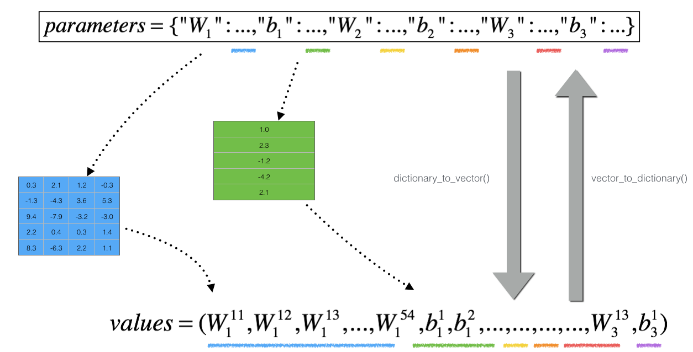

# **Gradient Checking**

## Problem Statement

You are part of a team working to make mobile payments available globally, and are asked to build a deep learning model to detect fraud--whenever someone makes a payment, you want to see if the payment might be fraudulent, such as if the user's account has been taken over by a hacker.

You already know that backpropagation is quite challenging to implement, and sometimes has bugs. Because this is a mission-critical application, your company's CEO wants to be really certain that your implementation of backpropagation is correct. Your CEO says, "Give me proof that your backpropagation is actually working!" To give this reassurance, you are going to use "gradient checking."

## 3 - How does Gradient Checking work?
Backpropagation computes the gradients $\frac{\partial J}{\partial \theta}$, where $\theta$ denotes the parameters of the model. $J$ is computed using forward propagation and your loss function.

Because forward propagation is relatively easy to implement, you're confident you got that right, and so you're almost 100% sure that you're computing the cost $J$ correctly. Thus, you can use your code for computing $J$ to verify the code for computing $\frac{\partial J}{\partial \theta}$.

Let's look back at the definition of a derivative (or gradient):$$ \frac{\partial J}{\partial \theta} = \lim_{\varepsilon \to 0} \frac{J(\theta + \varepsilon) - J(\theta - \varepsilon)}{2 \varepsilon} \tag{1}$$

If you're not familiar with the "$\displaystyle \lim_{\varepsilon \to 0}$" notation, it's just a way of saying "when $\varepsilon$ is really, really small."

You know the following:

$\frac{\partial J}{\partial \theta}$ is what you want to make sure you're computing correctly.
You can compute $J(\theta + \varepsilon)$ and $J(\theta - \varepsilon)$ (in the case that $\theta$ is a real number), since you're confident your implementation for $J$ is correct.
Let's use equation (1) and a small value for $\varepsilon$ to convince your CEO that your code for computing $\frac{\partial J}{\partial \theta}$ is correct!

## 4 - 1-Dimensional Gradient Checking

Consider a 1D linear function $J(\theta) = \theta x$. The model contains only a single real-valued parameter $\theta$, and takes $x$ as input. 

<caption>
<b>Figure 1</b>:1D linear model 
</caption>

The diagram above shows the key computation steps: First start with $x$, then evaluate the function $J(x)$ ("forward propagation"). Then compute the derivative $\frac{\partial J}{\partial \theta}$ ("backward propagation"). 

## N-Dimensional Gradient Checking
The following figure describes the forward and backward propagation of your fraud detection model.

<caption>
<b>Figure 2</b>: Deep neural network. LINEAR -> RELU -> LINEAR -> RELU -> LINEAR -> SIGMOID
</caption>

Let's look at your implementations for forward propagation and backward propagation. 

**How does gradient checking work?**.

As in Section 3 and 4, you want to compare "gradapprox" to the gradient computed by backpropagation. The formula is still:

$$ \frac{\partial J}{\partial \theta} = \lim_{\varepsilon \to 0} \frac{J(\theta + \varepsilon) - J(\theta - \varepsilon)}{2 \varepsilon} \tag{1}$$

However, $\theta$ is not a scalar anymore. It is a dictionary called "parameters". The  function "`dictionary_to_vector()`" has been implemented for you. It converts the "parameters" dictionary into a vector called "values", obtained by reshaping all parameters (W1, b1, W2, b2, W3, b3) into vectors and concatenating them.

The inverse function is "`vector_to_dictionary`" which outputs back the "parameters" dictionary.

<caption>
<b>Figure 2</b>: dictionary_to_vector() and vector_to_dictionary(). You will need these functions in gradient_check_n()
</caption>